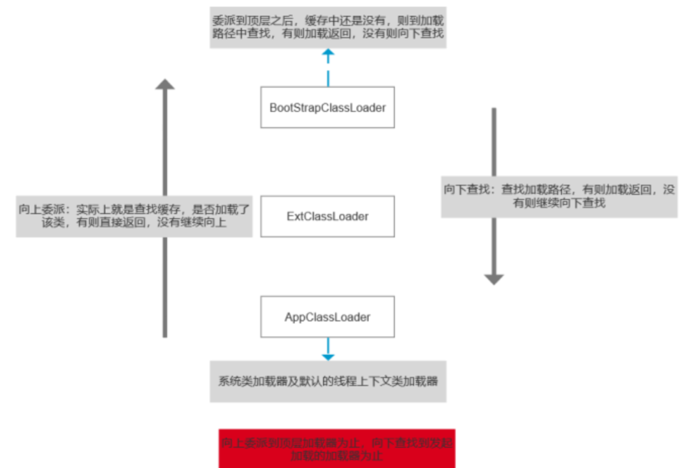

---
title: 👌java双亲委派机制是什么
date: 2025-05-02 13:33:41
tags:
	- JVM
categories: 笔记
--- 
# 👌java双亲委派机制是什么?

# 题目详细答案
JVM 的双亲委派机制是一种类加载机制，用于确保 Java 类加载过程的安全性和一致性。它的主要思想是：每个类加载器在加载类时，首先将请求委派给父类加载器，只有当父类加载器无法完成加载时，才由当前类加载器尝试加载类。

## 双亲委派机制的工作流程
**启动类加载器（Bootstrap ClassLoader）**：负责加载 Java 核心库（位于JAVA_HOME/lib目录下的类库，如rt.jar）。

**扩展类加载器（Extension ClassLoader）**：负责加载 Java 扩展库（位于JAVA_HOME/lib/ext目录下的类库）。

**应用程序类加载器（Application ClassLoader）**：负责加载应用程序类路径（classpath）上的类。

加载类的具体步骤如下：

1. **当前类加载器收到类加载请求**：当一个类加载器收到加载类的请求时，它不会立即尝试加载该类。
2. **将请求委派给父类加载器**：当前类加载器首先将加载请求委派给父类加载器。
3. **父类加载器处理请求**：

如果父类加载器存在，则父类加载器会继续将请求向上委派，直到到达启动类加载器。启动类加载器尝试加载类，如果成功，则返回类的引用。

4. **父类加载器无法加载类**：如果启动类加载器无法加载该类，加载失败返回到子类加载器。
5. **当前类加载器尝试加载类**：如果父类加载器无法加载该类，则由当前类加载器尝试加载。

通过这种机制，可以确保核心类库不会被篡改，避免了类的重复加载和类的冲突问题。

## 双亲委派机制的优点
**安全性**：通过将类加载请求逐级向上委派，可以避免核心类库被篡改或替换，确保系统安全。

**避免类的重复加载**：确保每个类只被加载一次，避免类的重复加载和类的冲突问题。

**提高加载效率**：通过委派机制，可以利用已经加载的类，提高类加载的效率。

## 双亲委派机制的例外
尽管双亲委派机制是 Java 类加载的标准机制，但在某些情况下，这一机制会被打破。例如：

**自定义类加载器**：某些自定义类加载器可能会覆盖默认的双亲委派机制，直接加载类。

**OSGi 框架**：OSGi 框架中，类加载机制更加复杂，可能会打破双亲委派机制。

**SPI（Service Provider Interface）**：在某些服务提供者接口的实现中，可能需要打破双亲委派机制来加载服务实现类。