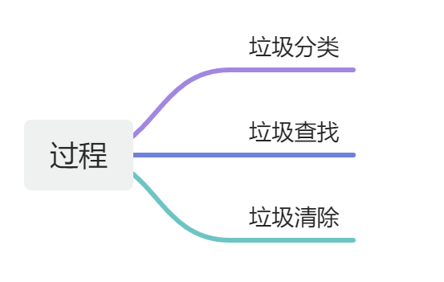

---
title: 👌一次完整的垃圾回收过程是什么样的？
date: 2025-04-25 13:33:41
tags:
	- JVM
categories: 笔记
--- 
# 👌一次完整的垃圾回收过程是什么样的？

# 题目详细答案
Jvm 垃圾回收的基本过程可以分为以下三个步骤：

# 垃圾分类
首先我们的 jvm 在进行垃圾回收的过程，需要确定哪些对象是垃圾对象，哪些对象是存活对象。这个类似于我们在做一件事之前的规划。具体的分类方法一般情况下，垃圾回收器会从堆的根节点（如程序计数器、虚拟机栈、本地方法栈和方法区中的类静态属性等），也就是 gc root。开始遍历对象图，标记所有可以到达的对象为存活对象，未被标记的对象则被认为是垃圾对象。进过标记后，分类成功。

# 垃圾查找
分类后，已经知道了对象所处的一个状态，jvm 会根据分类后对象，先找出所有垃圾对象，以便进行清理。

不同的垃圾收集，其中的查找方式会产生相应的差异。随着现在 jdk 的 升级与发展，还会产生更加高效的算法，后面会有垃圾收集的算法详细介绍。

## 垃圾清理
标记完成后，进行最后的清理与删除。这里涉及不同的垃圾收集器，清理的方式也不同，常见的有

标记-清除算法，复制算法，标记-整理算法，分代算法。

需要注意的是，垃圾清理可能会引起应用程序的暂停，不同的垃圾回收器通过不同的方式来减少这种暂停时间，从而提高应用程序的性能和可靠性。

常见的垃圾收集器有

Serial GC

Parallel GC

CMS GC（Concurrent Mark Sweep）

G1 GC（Garbage First）

ZGC