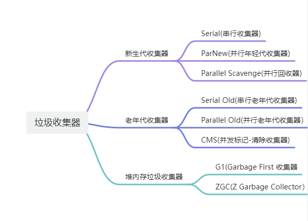

---
title: 👌常见的jvm垃圾收集器有哪些？
date: 2025-04-20 13:33:41
tags:
	- JVM
categories: 笔记
--- 

# 👌常见的jvm垃圾收集器有哪些？

# 题目详细答案
按照堆内存分代管理的思想，目前主要的垃圾收集器有：

## Serial 和Serial Old收集器
Serial是jvm中最早一批的收集器之一，它是一款单线程收集器。在进行垃圾收集时，需要暂停所有的用户线程（Stop-The-World）

> 它的设计初衷是为了适应早期的硬件环境和应用场景。在那个时候，硬件配置相对较低，主要特点包括内存容量较小、CPU 单核、并发应用场景相对较少。
>

基于这些限制条件，Serial 系列的垃圾收集器采用了简单高效、资源消耗最少、单线程收集的设计思路

简单高效：由于硬件资源有限，垃圾回收器需要设计得简单高效，以减少系统资源的占用。Serial 系列的垃圾收集器实现简单，适用于小型应用或者简单的测试场景。

资源消耗最少：考虑到当时硬件资源有限，Serial 系列的垃圾收集器尽可能地减少了对系统资源的占用。通过使用单线程执行垃圾回收操作，避免了多线程切换的开销，从而最大程度地节约了系统资源。

单线程收集：由于早期的硬件环境和应用场景下，并发需求较低，采用单线程收集的设计方案足以满足当时的需求。单线程收集简化了垃圾回收器的实现，并降低了系统复杂性，使得垃圾回收过程更加可控和稳定。

Serial采用复制算法进行垃圾收集，Serial Old 收集器是 Serial 的老年代版本，同样是一个单线程收集器，采用标记整理法进行垃圾收集

## Parallel Scavenge 和 Parallel Old收集器
与ParNew类似，也是一款用于新生代的多线程收集器。但Parallel Scavenge的目标是达到一个可控制的吞吐量，而ParNew的目标是尽可能缩短垃圾收集时用户线程的停顿时间。

> 随着硬件资源的升级，包括内存空间的增大和 CPU 的多核化，传统的 Serial 垃圾收集器面临着性能瓶颈。由于它采用单线程执行垃圾回收操作，无法充分利用多核 CPU 的优势，导致在处理大内存空间时性能下降，垃圾回收时间变得更长。为了充分发挥多核 CPU 的优势，JVM 推出了 Parallel 收集器系列。Parallel 收集器的设计思想是利用多线程并行执行垃圾回收操作，以提高整个垃圾收集过程的并行度和性能。
>

Parallel 收集器的核心特点包括

多线程并行执行：Parallel 收集器利用了多核 CPU 的优势，通过多个线程同时执行垃圾回收操作，加快了垃圾收集的速度。

高吞吐量：由于并行执行垃圾收集操作，Parallel 收集器适用于吞吐量要求较高的应用场景。它能够在保证吞吐量的同时，尽可能地减少垃圾收集的停顿时间。

适用于大内存堆：随着内存空间的扩大，Parallel 收集器能够更好地应对大内存堆的情况，通过并行执行垃圾收集操作，提高了整个垃圾收集过程的效率。

相比于传统的 Serial 收集器，Parallel 收集器能更好地适应现代应用的需求，特别是大型内存堆和高吞吐量的场景。

Parallel Scavenge是一款采用复制算法进行垃圾收集的新生代收集器，Parallel Old是Parallel Scavenge收集器的老年代版本，也是一款多线程的收集器，采用标记整理法进行垃圾收集

## ParNew 收集器
ParNew 和 Parallel Scavenge 垃圾收集器都属于并行垃圾收集器。但ParNew的目标是尽可能缩短垃圾收集时用户线程的停顿时间。

>  ParNew 垃圾收集器之所以应用更加广泛，一个重要原因是它是唯一能与 CMS（Concurrent Mark-Sweep）收集器配合使用的新生代收集器，特别适用于那些对停顿时间要求较高的应用场景。
>

以下是 ParNew 垃圾收集器的一些特点和与 CMS 配合的优势

与 CMS 配合：ParNew 垃圾收集器能够与 CMS 垃圾收集器配合使用，用于处理老年代的垃圾回收。在这种组合中，ParNew 负责新生代的垃圾收集，而 CMS 负责老年代的并发垃圾收集。这种分工合作可以有效地减少应用程序的停顿时间，满足对低停顿时间的需求。

并行收集：ParNew 垃圾收集器采用多线程并行收集的方式，类似于 Parallel Scavenge 收集器。它能够充分利用多核 CPU 的优势，加快垃圾收集的速度，提高整个应用程序的性能。

应对停顿时间要求高的场景：由于 ParNew 与 CMS 配合使用，可以针对那些对停顿时间要求较高的应用场景。CMS 收集器通过并发执行垃圾回收操作，尽量减少停顿时间，而 ParNew 则能够在新生代中高效地执行垃圾回收操作，进一步降低停顿时间。

ParNew采用复制算法进行垃圾收集，是一款新生代的并行收集器

## CMS收集器
CMS 垃圾收集器的设计初衷是允许垃圾收集器在进行垃圾回收的同时，与应用程序的线程并发执行，不需要长时间暂停应用程序线程。它的工作原理是通过并发标记和清除的方式，先标记所有的存活对象，然后清除未被标记的对象。允许在垃圾收集过程中与应用程序并发执行，从而降低了垃圾收集的停顿时间，提高了系统的响应性和用户体验。

> 随着硬件技术的发展，可用内存越来越大，这为应用程序提供了更多的内存空间，从而能够创建更多的对象，减少了垃圾收集的频率。然而，随着内存空间的增大，垃圾收集的时间也相应增加，可能导致长时间的停顿，影响用户体验。在这种情况下，传统的垃圾收集器需要暂停应用程序线程进行垃圾收集，这会导致用户在执行某些操作时出现延迟甚至停顿的情况，这是无法接受的。
>

CMS 垃圾收集器的优势

并发标记和清除：CMS 垃圾收集器采用了并发标记和清除的方式，允许在垃圾收集过程中与应用程序并发执行。这意味着垃圾收集过程中只有一小部分时间需要暂停应用程序线程。

低停顿时间：由于并发执行的特性，CMS 垃圾收集器能够在较短的时间内完成垃圾回收操作，从而减少了应用程序的停顿时间。通常情况下，CMS 垃圾收集器能够将停顿时间控制在几百毫秒甚至更低。

CMS 垃圾收集器主要针对老年代进行垃圾回收，对于新生代则通常使用 ParNew 收集器。这种分代收集的方式能够更好地适应不同内存区域的特点和垃圾回收需求。使用了标记清除法+标记整理法

## G1收集器
CMS 垃圾收集器开创了垃圾收集器的一个新时代，实现了垃圾收集和用户线程同时执行，从而达到了垃圾收集的过程不停止用户线程的目标。这种并发垃圾收集的思路为后续垃圾收集器的发展提供了重要的参考。

> 随着硬件资源的不断升级，可用的内存资源越来越多，这对于垃圾收集器的发展提出了新的挑战。传统的垃圾收集器采用物理分区的方式将内存分为老年代、新生代、永久代或 MetaSpace，但随着可用内存的增加，某一分代区域的大小可能会达到几十上百 GB。在这种情况下，传统的物理分区收集方式会导致垃圾扫描和清理时间变得更长，性能下降。
>

G1 垃圾收集器摒弃了传统的物理分区方式

将整个内存分成若干个大小不同的 Region 区域。每个 Region 在逻辑上组合成各个分代，这样做的好处是可以以 Region 为单位进行更细粒度的垃圾回收。G1 垃圾收集器在进行垃圾回收时，可以针对单个或多个 Region 进行回收，从而提高了收集效率和性能。

G1 垃圾收集器吸取了 CMS 垃圾收集器的优良思路并通过摒弃物理分区、采用 Region 分区的方式，实现了更细粒度的垃圾回收，从而提高了整个系统的性能和可用性。 G1 垃圾收集器在大内存环境下的表现更加出色，成为了现代 Java 应用中的重要选择。

### Region（局部收集）
G1 垃圾收集器的最核心分区基本单位是 Region。与传统的垃圾收集器不同，G1 不再将堆内存划分为固定连续的几块区域，而是完全舍弃了物理分区，而是将堆内存拆分成大小为 1MB 到 32MB 的 Region 块。然后，以 Region 为单位自由地组合成新生代、老年代、Eden 区、Survivor 区和大对象区（Humongous Region）等。随着垃圾回收和对象分配的进行，每个 Region 也不会一直固定属于某个分代，它们可以随时扮演任何一个分代区域的内存角色。

### Collect Set（智能收集）
在G1里面会维护一个Collect Set集合。这个集合记录了待回收的 Region 块的信息，包括每个 Region 块可回收的大小空间。有了这个 CSet 信息，G1 在进行垃圾收集时可以根据用户设定的可接受停顿时间来进行分析，找出在设定的时间范围内收集哪些区域最划算，然后优先收集这些区域。这样做不仅可以优先收集垃圾最多的 Region，还可以根据用户的设定来计算收集哪些 Region 可以达到用户所期望的垃圾收集时间。

通过 CSet，G1 垃圾收集器的性能得到了极大的提升，并且能够实现可预测的停顿时间要求。这使得垃圾回收过程变得更加智能化，更加适应不同的应用场景和用户需求。需要注意的是，用户设定的时间应该合理，官方建议在 100ms 到 300ms 之间，以平衡垃圾收集的效率和停顿时间的需求。

G1采用标记复制法进行垃圾收集，是一款适用于整个堆内存的并行收集器

## ZGC收集器
ZGC（Z Garbage Collector）是一种低延迟的垃圾回收器，是 JDK 11 引入的一项重要特性。ZGC 的出现为 Java 应用提供了一种更加高效、可预测的垃圾回收解决方案，与传统的垃圾回收器相比，ZGC 的主要目标是实现极低的垃圾回收停顿时间，使得 Java 应用能够以更可预测的方式运行，尤其在大内存堆上表现良好。

ZGC 的优势和特点包括：

低停顿时间：ZGC 致力于将垃圾回收的停顿时间降至最低。它通过并发标记、并发清理等技术，在整个垃圾回收过程中尽量减少对应用程序的影响，从而实现了极低的垃圾回收停顿时间。这使得 Java 应用能够更加平滑地运行，减少了因垃圾回收而导致的不可预测性和性能波动。

可预测性：ZGC 的设计注重可预测性，即使在大内存堆上，也能够提供稳定的性能和可预测的垃圾回收行为。这使得开发人员能够更加信任和依赖于 Java 应用在生产环境中的稳定性和可靠性。

适用于大内存堆：ZGC 的低停顿时间特性使其特别适用于大内存堆的场景。在这种场景下，传统的垃圾回收器可能会面临长时间的停顿，影响应用的响应性和用户体验，而 ZGC 能够有效地缓解这一问题，保持较低的停顿时间，从而确保应用的流畅运行。

ZGC采用并发标记法+并发清理进行垃圾收集，是一款适用整个堆内存并行收集器。
